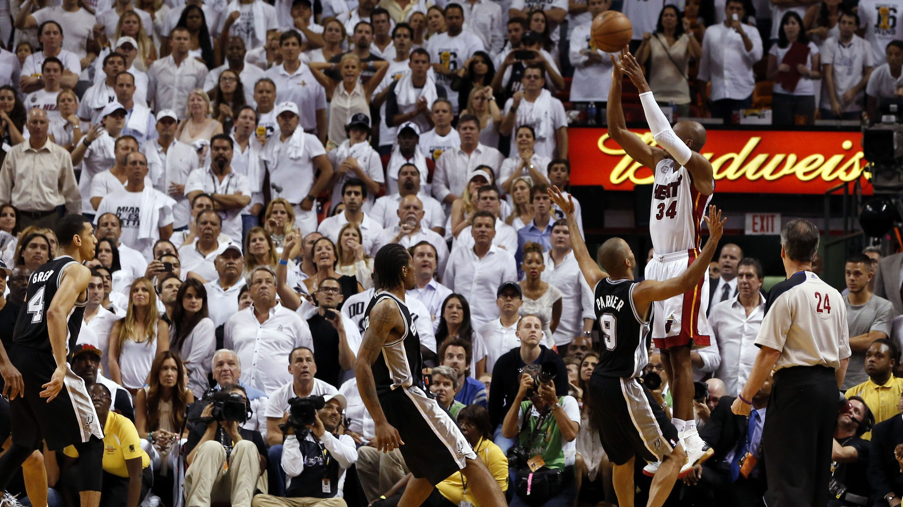
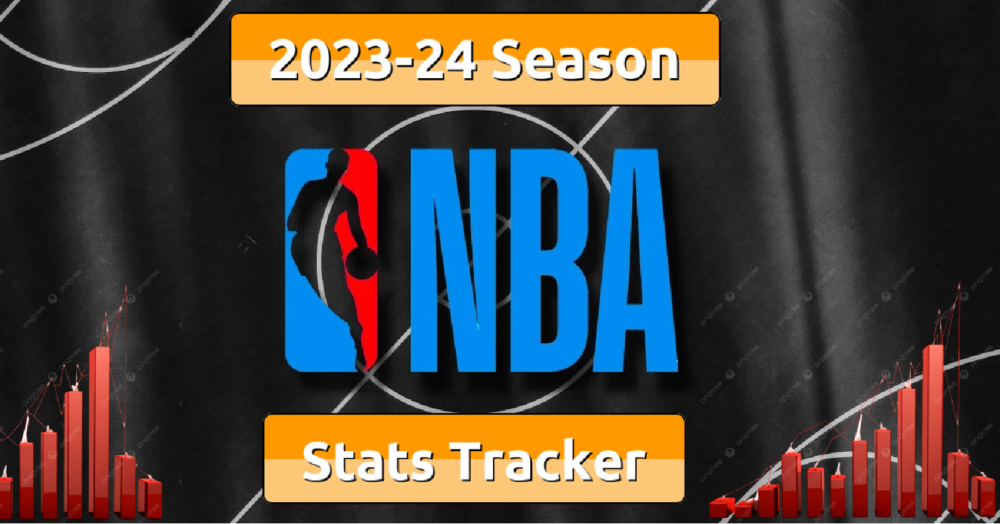

# **Court Chronicle**

# An NBA Draft Analysis

# **Is this the Beginning of the End of the NCAA?**

The 2023-24 NBA Draft set some new records, with a staggering 242 prospects
looking to enter the league. But what's truly groundbreaking is the
unprecedented number of top picks who didn't take the traditional college
route. Five of the top ten draftees came from pathways outside the NCAA (most
since 2001), marking a pivotal shift in the NBA landscape. Let's delve into the
unique origins of these rising stars and explore the potential for a new era of
future NBA prospects where college may not be the top option anymore.

[View NBA Draft Analysis](https://drive.google.com/file/d/19cYosz2xPq3nBMrmeGpep4MNnxDNWR7n/view?usp=sharing)

# What makes a Great Shooter?

# **Are NBA-Level Shooters born... or are they made?**

Think of some of the greatest players in NBA history to ever shoot the basketball. You may have thought of 
the great ones like Ray Allen, Reggie Miller, and of course Steph Curry. All of these players are historically
known for their consistent shooting form along with their ability to put the ball in the basket.
But is there something that they all have in common? Are some positions better at shooting than others?
Does height and weight affect how good someone is at shooting? All of these questions are explored and answered 
in this analysis.

[View Project 2](https://public.tableau.com/app/profile/robert.riemer/viz/CareerFoundryProject6_73/PROJECT)

# NBA 2023-24 Season Statistics Tracker

## **Every Player. Every Team.** 

The 2023-24 NBA Season came to a close on April 14th, 2024. There were many historic regular season performances this year
coming from both superstars and some fresh faces in the league as well. 

[View Project 3](https://public.tableau.com/views/BostonCeltics2023-2024SeasonStatTracker/Story1?:language=en-US&:sid=&:display_count=n&:origin=viz_share_link)

# Project in Progress

## **Next Project Coming Soon** 

[View Project 3](https://www.youtube.com/watch?v=q6EoRBvdVPQ&ab_channel=revergo)

