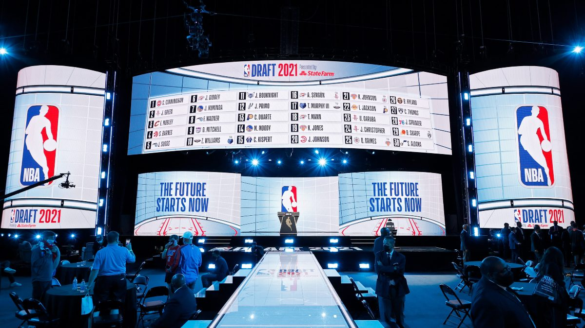

# Court Chronicle

## An NBA Draft Analysis

# Is this the beginning of the end of the NCAA? 

The 2023-24 NBA Draft set some new records, with a staggering 242 prospects
looking to enter the league. But what's truly groundbreaking is the
unprecedented number of top picks who didn't take the traditional college
route. Five of the top ten draftees came from pathways outside the NCAA (most
since 2001), marking a pivotal shift in the NBA landscape. Let's delve into the
unique origins of these rising stars and explore the potential for a new era of
future NBA prospects where college may not be the top option anymore.

[View NBA Draft Analysis](https://drive.google.com/file/d/19cYosz2xPq3nBMrmeGpep4MNnxDNWR7n/view?usp=sharing)

## Project 2: Project Name

Description of Project 2 goes here. Nulla convallis libero et lorem fringilla, ut posuere felis dapibus. Integer ac ultricies justo. 

[View Project 2](link_to_project)

## Project 3: Project Name

Description of Project 3 goes here. Ut posuere felis dapibus. Integer ac ultricies justo, nec euismod purus. 

[View Project 3](link_to_project)
